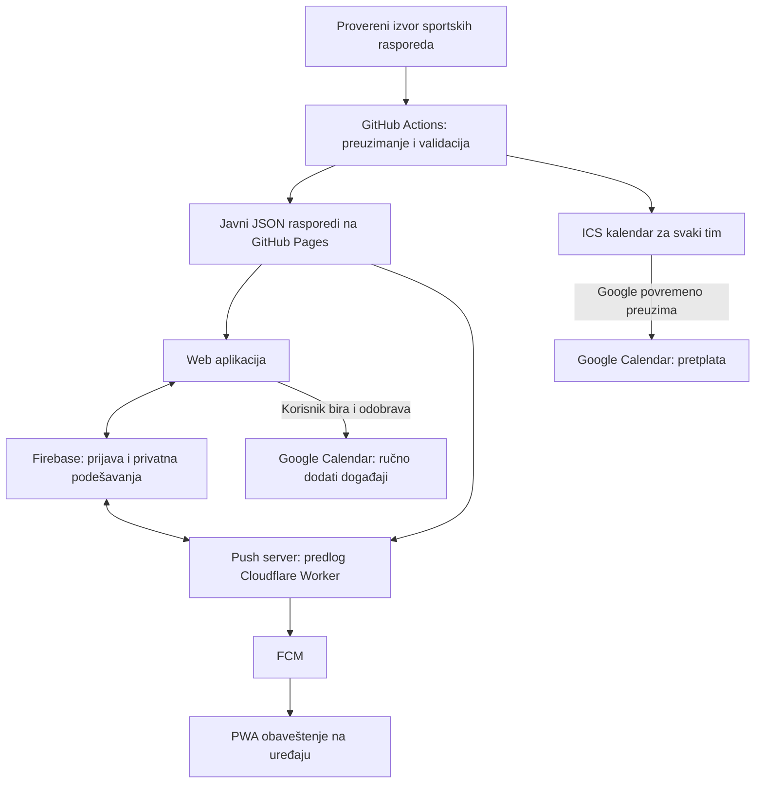

# MatchAhead — specifikacija i plan rada za Grok AI agenta

Verzija 2.0 · Istraživanje: 26. septembar 2026. · Jezik proizvoda: srpski, latinica.

**Nov redosled rada:** koristi [paket od 12 manjih zadataka](grok-faze/README.md) i njegov [stalni kontekst](grok-faze/00-stalni-kontekst.md). On zamenjuje ranijih šest velikih faza. PWA, prava push obaveštenja i lična agenda sada su obavezni u prvoj verziji; tehnička dopuna je u odeljku 18.

**Novije korisnikovo pojašnjenje, 26. septembar 2026:** glavni tok je „Pronađi utakmice” na klik za izabrani sport, klub i sezonu, zatim ručno „Osveži raspored” kada korisnik želi. Stalno automatsko preuzimanje sportskih rasporeda, uključujući predlog na svaka tri sata u starijim odeljcima ovog plana, **nije zahtev i ne primenjuje se**. Važeći predlog je u `docs/data-alternatives.md`, a provera u zadatku 01B. Push server i dalje mora obrađivati dospele podsetnike dok je PWA zatvorena.

**Ograničenje izbora, 27. septembar 2026:** u prvoj verziji korisnik može izabrati samo FK Crvenu zvezdu, FK Partizan, KK Crvenu zvezdu ili KK Partizan. Ova odluka ima prednost nad starijim predlogom kataloga svih srpskih klubova u nastavku dokumenta. Protivnički klubovi se i dalje normalno prikazuju u utakmicama.

## 1. Potvrđen zahtev i granice projekta

Napraviti web aplikaciju za više korisnika, prilagođenu telefonu. Korisnik se prijavljuje Google nalogom, bira sport i srpski klub, pregleda predstojeće utakmice i dodaje ih u Google Calendar. Potrebna su dva režima: automatsko praćenje kluba i ručni izbor utakmica.

Korisnik je potvrdio:

- Početni sportovi su fudbal i košarka.
- Za četiri dozvoljena izbora (FK/KK Crvena zvezda i FK/KK Partizan) treba obuhvatiti sve tada objavljene utakmice, uključujući domaća, regionalna i evropska takmičenja.
- Budžet je 0 €. Željeni hosting je GitHub, a baza besplatni Firebase.
- Automatski režim sme koristiti kalendarsku pretplatu; prihvatljivo je da Google preuzima izmene sa zakašnjenjem.
- Aplikacija je namenjena većem broju korisnika, uz dobar prikaz na telefonu.
- Mora biti instalabilna PWA sa pravim push notifikacijama i dok je zatvorena.
- Mora imati pregled svih utakmica dodatih ili praćenih kroz aplikaciju, po redosledu, sa jasno izdvojenom sledećom utakmicom.

Radna pretpostavka: prvi katalog čine seniorski muški timovi iz najvišeg domaćeg fudbalskog ranga i relevantnih domaćih/regionalnih košarkaških takmičenja. To je predlog početnog kataloga, ne zahtev korisnika da se isključe ženski klubovi ili niže lige. Model podataka mora podržati njihovo kasnije dodavanje bez izmene osnovne arhitekture. Prijateljske utakmice prikazivati kada postoje provereni podaci, uz poseban filter i jasnu oznaku pokrivenosti.

Potvrđeno ime aplikacije je **MatchAhead**. Projektni slug je `matchahead`.

**Najvažnije ograničenje:** besplatna infrastruktura može da podrži ovu arhitekturu, ali ovim istraživanjem nije dokazana potpuna, besplatna i dozvoljena dostupnost rasporeda svih traženih takmičenja. Provera izvora je prva razvojna faza. Ne predstavljati delimičnu pokrivenost kao „sve utakmice”.

Grok je razvojni agent. AI model nije potreban u samoj aplikaciji i ne sme da izmišlja rasporede, klubove, termine ili rezultate.

## 2. Istraživanje sličnih proizvoda

Pregledane su javne stranice i dokumentacija; nisu sprovedeni testovi prijave, pretplate ili dugoročnog osvežavanja ovih proizvoda.

| Proizvod | Javno opisane mogućnosti | Pouka za naš proizvod |
|---|---|---|
| [Fixtur.es](https://fixtur.es/en/premier-league) | Sportski kalendari za postojeće kalendarske aplikacije. Postoji i [stranica FK Partizana](https://issp.fixtur.es/en/team/fk-partizan), koja navodi automatske promene termina i evropske utakmice kada se klub takmiči. | Put od izbora kluba do pretplate mora biti kratak. Sama funkcija „utakmice u kalendaru” već postoji. |
| [FotMob](https://newsletter.fotmob.com/p/the-assist-the-new-season-is-here) | Zvanični newsletter upućuje na sinhronizaciju rasporeda sa stranice kluba. | Raspored treba pregledati pre povezivanja kalendara. |
| [Sync2Cal](https://www.sync2cal.com/help/how-google-calendar-sync-works) | Nudi direktan Google OAuth upis u namenski kalendar i alternativnu ICS pretplatu. Dokumentacija razlikuje automatsku pretplatu od jednokratnog uvoza. | Korisniku jasno objasniti dva načina rada i ko kontroliše brzinu ažuriranja. |
| [ECAL](https://ecal.com/sports/) | Sportske organizacije koriste ga za kalendare, podsetnike, informacije o prenosu i karte. | Prenosi i karte mogu biti kasnije dopune; ne opterećivati njima prvu verziju. |

Predložena razlika našeg proizvoda je objedinjeno praćenje srpskog kluba kroz više takmičenja, srpski interfejs i vidljiva pouzdanost podataka. To je hipoteza vrednosti koju treba proveriti sa korisnicima; nije dokazana tržišna praznina niti tvrdnja da konkurenti nemaju te funkcije.

## 3. Preporučena arhitektura za 0 €

### 3.1 Komponente

| Komponenta | Izbor | Namena |
|---|---|---|
| Korisnički interfejs | React + TypeScript + Vite | Instalabilna PWA, agenda i offline prikaz |
| Hosting | GitHub Pages | HTML, JavaScript, stilovi, dozvoljeni javni rasporedi i ICS datoteke |
| Identitet | Firebase Authentication, Google provider | Prijava korisnika |
| Privatna podešavanja | Cloud Firestore, Spark plan | Omiljeni klubovi, opcije prikaza i evidencija ručno dodatih događaja |
| Osvežavanje sportskih podataka | GitHub Actions | Periodično preuzimanje, validacija i izgradnja statičkih podataka |
| Automatski kalendar | Javni HTTPS ICS feed po timu | Google povremeno preuzima objavljene izmene |
| Ručni upis | Google Calendar API iz otvorenog browsera | Dodavanje izabranih utakmica uz posebnu dozvolu korisnika |
| Push isporuka | Firebase Cloud Messaging | Sistemske notifikacije uz dozvolu na uređaju |
| Push server | Kandidat: Cloudflare Workers Free + Cron | Zakazivanje i slanje; obavezna rana proba besplatnih limita |
| Provere | Vitest, Firebase Emulator, Playwright i stvarni telefoni | Logika podataka, izolacija korisnika, PWA i push tokovi |

Ovo su projektne preporuke, ne obavezni zahtevi dobavljača. Grok treba da proveri trenutno podržane verzije biblioteka i zaključa zavisnosti lockfile datotekom.

Ne koristiti Firebase Cloud Functions, Cloud Scheduler, Cloud Tasks, Cloud Run, plaćeni sportski API ili Firebase Cloud Storage kao obavezan deo prve verzije. Za ovu arhitekturu nisu potrebni. Firebase ima odvojene Spark i Blaze mogućnosti; besplatna kvota na Blaze planu nije isto što i rad bez uključene naplate. [Firebase planovi](https://firebase.google.com/docs/projects/billing/firebase-pricing-plans).

Besplatni GitHub Pages polazi od javnog repozitorijuma na besplatnom nalogu. Kod i objavljeni sportski podaci su javni; korisnička podešavanja nisu. GitHub ograničava Pages upotrebu za komercijalni SaaS i navodi ograničenja veličine i saobraćaja. Ovaj predlog je za nekomercijalni početni projekat; pre monetizacije ponovo proceniti hosting. [GitHub Pages ograničenja](https://docs.github.com/en/pages/getting-started-with-github-pages/github-pages-limits).

### 3.2 Tok podataka



Zajednički raspored preuzimati jednom za sve korisnike. Otvaranje aplikacije ne sme da izazove novi poziv sportskom API-ju. GitHub Actions obrađuje samo javne sportske podatke i ne dobija Google tokene korisnika niti pristup njihovim kalendarima.

## 4. Razlika između dva režima

### 4.1 Automatski režim: „Prati klub u kalendaru”

1. Korisnik bira fudbal ili košarku i konkretan tim.
2. Vidi predstojeće utakmice, pokrivena takmičenja i vreme poslednje uspešne provere izvora.
3. Aplikacija daje stabilan HTTPS URL kalendara tog tima.
4. Korisnik završava pretplatu u Google Calendaru.
5. GitHub Actions objavljuje nove verzije iste ICS datoteke.
6. Google sam određuje kada će preuzeti novu verziju.

Za ovaj režim aplikaciji nije potrebna dozvola da piše u korisnikov Google Calendar. Google login služi čuvanju omiljenih klubova i podešavanja.

Pretplata i preuzimanje datoteke moraju biti dva jasno različita dugmeta. Jednokratno uvezena ICS datoteka ne dobija buduće izmene. Kašnjenje pretplate može trajati satima i ne treba obećavati određen interval. [Objašnjenje ova dva načina](https://www.sync2cal.com/help/how-google-calendar-sync-works).

Google navodi da se pretplata na kalendar ne dodaje iz mobilne Calendar aplikacije. Zato obezbediti uputstvo za web verziju na računaru, kopiranje linka i provereni prečac ako radi; ne obećavati da će svaka mobilna kombinacija završiti pretplatu jednim klikom. Posle pretplate proveriti vidljivost kalendara na telefonu. [Google uputstvo](https://support.google.com/calendar/answer/37100?hl=en).

Bez dodatnog čitanja Google naloga aplikacija ne zna da li je pretplata zaista završena. Status nazvati „Link otvoren” ili „Korisnik potvrdio pretplatu”, a ne „Google sinhronizacija uspešna”. Brisanje favorita u aplikaciji ne odjavljuje pretplatu u Google Calendaru; prikazati posebna uputstva za odjavu.

### 4.2 Ručni režim: „Dodaj izabrane utakmice”

Korisnik označava utakmice i vidi pregled pre upisa. Tek tada aplikacija traži Google Calendar dozvolu. Kreira se poseban kalendar, npr. „MatchAhead — izbor”. Koristiti minimalni scope `https://www.googleapis.com/auth/calendar.app.created`, koji omogućava upravljanje kalendarima napravljenim kroz aplikaciju. [Google scope dokumentacija](https://developers.google.com/workspace/calendar/api/auth).

Predlog implementacije je Google Identity Services token model u browseru: kratkotrajni access token držati samo u memoriji. Ne čuvati refresh tokene u Firebase bazi, GitHub Secrets, localStorage ili repozitorijumu. Kada korisnik kasnije izabere „Osveži moje događaje”, ponovo zatražiti pristup po potrebi. [Google token model](https://developers.google.com/identity/oauth2/web/guides/use-token-model).

Ručni režim u verziji sa budžetom 0 € **ne ažurira lične događaje dok je aplikacija zatvorena**. Prikazati to pored dugmeta za dodavanje. Automatska klupska pretplata nastavlja rad nezavisno od otvorene aplikacije.

Firebase prijava i Calendar autorizacija su odvojeni koraci. Odbijanje Calendar dozvole ne sme odjaviti korisnika ili onemogućiti pregled rasporeda. [Firebase Google prijava](https://firebase.google.com/docs/auth/web/google-signin).

Ako Calendar OAuth još nije spreman za javnu objavu, privremeni ručni režim može otvoriti Google obrazac za pojedinačni događaj ili izvesti izabrane utakmice u ICS. Taj režim označiti kao privremen i jednokratan; ne tvrditi da je direktna integracija završena. Sa takvim izvozom aplikacija ne može pouzdano potvrditi da je korisnik završio upis.

### 4.3 Duplikati i prelazak između režima

- Unutar jednog feeda ista utakmica postoji jednom, čak i kada je pronađena u više izvora.
- Kod ručnog API upisa ista utakmica u istom namenskom kalendaru ima stabilan event ID.
- Ako korisnik prati dva protivnička kluba kroz dva odvojena ICS kalendara, međusobna utakmica može se prikazati dva puta. Isti ICS UID u dva kalendara ne garantuje Google deduplikaciju.
- Pretplata na klub i ručno dodavanje iste utakmice takođe mogu dati dve kopije.
- UI treba da upozori na poznata preklapanja i ponudi preskakanje ručnog upisa. Ne čitati sve privatne kalendare radi traženja duplikata.
- Personalizovani objedinjeni feed za proizvoljan skup klubova nije deo osnovne statičke arhitekture; zahteva zasebno rešenje i novu procenu.

## 5. Pokrivenost sportskih podataka: prvo dokazati, zatim graditi

### 5.1 Matrica takmičenja

Za svaki izabrani srpski tim prikupiti sva objavljena takmičenja u kojima stvarno učestvuje u datoj sezoni. Ne upisivati pretpostavljene buduće protivnike iz žreba.

| Sport | Kategorije koje treba proveriti |
|---|---|
| Fudbal | Domaće prvenstvo, Kup Srbije, evropske kvalifikacije i glavne faze UEFA takmičenja, potvrđene prijateljske utakmice |
| Košarka | KLS/domaća Superliga prema stvarnom formatu sezone, Kup Radivoja Koraća, ABA i ABA 2 gde su relevantne, EuroLeague, EuroCup i druga evropska takmičenja srpskih klubova, potvrđene prijateljske utakmice |

Prisustvo takmičenja u ovoj tabeli ne znači da je određeni klub učesnik. Katalog učesnika i sezona mora doći iz proverljivih podataka. Žrebovi i plej-of često objavljuju raspored postepeno.

### 5.2 Kandidati za izvore

**API-FOOTBALL:** ima javnu listu pokrivenosti sa Srbijom i besplatni plan sa 100 zahteva dnevno. Cenovnik navodi ograničenja dostupnih sezona na besplatnim planovima. Kandidat je za tehnički eksperiment, ali nije dokazano da besplatan nalog daje tekuću sezonu svih naših takmičenja. [Pokrivenost](https://www.api-football.com/coverage), [planovi](https://www.api-football.com/pricing).

**API-BASKETBALL:** javno navodi ABA, EuroLeague, EuroCup i više srpskih takmičenja, kao i besplatni plan sa 100 zahteva dnevno. Dostupnost konkretnih sezona, budućih utakmica i ispravki termina proveriti stvarnim zahtevima. [Zvanična pokrivenost i planovi](https://api-sports.io/sports/basketball).

**Football-data.org:** besplatni plan navodi 12 takmičenja i 10 poziva u minutu. Prema objavljenom obimu nije dovoljan kao jedini izbor za kompletan srpski fudbal i ne pokriva naš zahtev za košarku. [Cenovnik](https://www.football-data.org/pricing), [pokrivenost](https://www.football-data.org/coverage).

**TheSportsDB:** višesportski kandidat, ali besplatni endpointi imaju konkretna ograničenja rezultata. Ne pretpostavljati da je besplatan plan dovoljan za slobodnu pretragu svih klubova i potpun raspored. [Dokumentacija](https://www.thesportsdb.com/documentation).

**Zvanični rasporedi:** [Superliga](https://www.superliga.rs/en/sezona/raspored-i-rezultati/), [KLS kalendar](https://kls.rs/kalendar/) i [ABA](https://www.aba-liga.com/) jesu polazne tačke za proveru podataka. Postojanje javne stranice nije potvrda javnog API-ja, dozvole za automatsko preuzimanje ili dozvole za ponovno objavljivanje. Ne zasnivati projekat na nedokumentovanim privatnim API-jima rezultatskih aplikacija.

Za planiranu javnu JSON/ICS distribuciju zabeležiti uslove korišćenja i prava za podatke i grbove. API-FOOTBALL izričito navodi da API pristup sam po sebi ne daje sva prava objavljivanja. Po potrebi tražiti pojašnjenje dobavljača; ne zaključivati da odsustvo naplate znači odsustvo ograničenja. [Uslovi](https://www.api-football.com/terms).

### 5.3 Konkretna provera pre implementacije

Napraviti `docs/data-feasibility.md` i tabelu sa kolonama: sport, interni tim, takmičenje, sezona, provider ID, besplatan pristup potvrđen, naredne utakmice dostupne, preciznost vremena, statusi odlaganja, dozvoljen način objave, dnevni broj zahteva, dokaz i datum provere.

Testirati reprezentativne klubove: FK Partizan, FK Crvena zvezda, FK Vojvodina, KK Partizan, KK Crvena zvezda i bar jedan drugi domaći košarkaški klub iz aktuelnog kataloga. Primeri nisu tvrdnja o njihovom trenutnom učešću u pojedinim takmičenjima.

Za svaki tim porediti objavljen raspored narednih 30–90 dana sa zvaničnim rasporedom. Razlikovati „raspored još nije objavljen”, „takmičenje nije podržano” i „izvor trenutno ne radi”. Testirati da li besplatni endpoint daje aktuelnu sezonu i da li paginacija skriva deo rezultata.

Ishodi:

1. **Besplatan automatizovan izvor potvrđen:** nastaviti punu implementaciju.
2. **Potvrđena delimična pokrivenost:** objaviti tačan spisak podržanih takmičenja; ostatak ostaje otvoren zadatak, uz odobrenje korisnika za suženu verziju.
3. **Nema odgovarajućeg izvora:** ponuditi administrativno održavanje rasporeda u strukturisanim datotekama ili dozvoljeni partnerski feed. To je poluautomatsko održavanje, ne ostvarenje zahteva za potpuno automatskim podacima.

Ne prelaziti na plaćeni API, ne praviti više besplatnih naloga radi zaobilaženja kvote i ne koristiti izmišljene podatke kao produkcione.

## 6. Korisnički tok i ekrani

### 6.1 Početna stranica

Jedna jasna poruka: „Izaberi klub. Prati njegove utakmice u svom kalendaru.” Dugmad: „Pronađi klub” i „Prijavi se Google nalogom”. Pregled rasporeda može raditi bez prijave; čuvanje izbora i upravljanje ručnim događajima traže prijavu.

### 6.2 Izbor sporta i kluba

Dva sporta, zatim pretraga kluba. Rezultat uvek pokazuje sport, naziv tima i grad. FK i KK su odvojeni timovi čak i kada dele ime. Podržati alias pretragu: ćirilica/latinica, „Zvezda”/„Crvena zvezda”/„Red Star”, nazive bez dijakritike i relevantna sponzorska imena. Mapiranje identiteta ostaje eksplicitno i provereno.

Na stranici kluba prikazati spisak pokrivenih takmičenja, a ne samo opštu oznaku „podržano”. Kada je pokrivenost nepotpuna, poruka mora stajati pre dugmeta za pretplatu.

### 6.3 Raspored

Podrazumevani prikaz je pregledna lista po datumima. Za svaku utakmicu: domaćin, gost, sport, takmičenje, lokalni datum i vreme, status, lokacija ako postoji i dugme za izbor. Filteri: takmičenje, domaćin/gost i prijateljske utakmice. Filteri liste nisu automatski filteri javnog ICS feeda; interfejs mora jasno označiti njihov domet.

Prikazati „Podaci provereni…” i odvojeno „Termin potvrđen / termin još nije potvrđen”. Vreme prilagoditi browser zoni uz mogućnost izbora zone; koristiti `Europe/Belgrade` kao početnu rezervnu vrednost, ne fiksni UTC pomak.

### 6.4 Moji klubovi i podešavanja

Omiljeni klubovi, režim praćenja, uputstvo za pretplatu, ručno dodati događaji, dugme za njihovo osvežavanje, podsetnici za ručni režim, vremenska zona, odjava i brisanje naloga.

Status automatskog režima opisuje objavljeni feed. Status ručnog režima opisuje poslednji uspešan API upis. Nikada ih ne objediniti u nejasnu zelenu oznaku „sve sinhronizovano”.

### 6.5 Obavezna prazna i grešna stanja

Nema objavljenih utakmica; nepotpuna pokrivenost; izvor kasni; korisnik je odbio Calendar dozvolu; istekao access token; pop-up blokiran; Google kvota; Firebase kvota; deo događaja dodat, deo nije; kalendar obrisan; podaci dostupni samo iz poslednje uspešne verzije.

## 7. Model podataka

### 7.1 Javni sportski katalog i normalizovan raspored

Predloženi TypeScript ugovori:

```ts
type Sport = 'football' | 'basketball';
type FixtureStatus =
  | 'scheduled' | 'time_tbd' | 'postponed' | 'cancelled'
  | 'live' | 'finished' | 'abandoned';

interface Team {
  id: string;                 // interni, stabilan identitet
  sport: Sport;
  name: string;
  country: string;
  aliases: string[];
  providerIds: Record<string, string>;
}

interface Fixture {
  id: string;                 // ne zavisi od termina ni imena sponzora
  sport: Sport;
  competitionId: string;
  seasonId: string;
  homeTeamId: string;
  awayTeamId: string | null;   // npr. žreb još nije odredio protivnika
  startsAtUtc: string | null;
  scheduledLocalDate: string | null;
  sourceTimeZone: string | null;
  timeConfirmed: boolean;
  status: FixtureStatus;
  venue: string | null;
  sourceUrl: string;
  provider: string;
  providerFixtureId: string | null;
  fetchedAt: string;
  sourceUpdatedAt: string | null;
  contentHash: string;
  revision: number;
}
```

Datoteke: katalog timova/takmičenja, rasporedi po timu ili takmičenju, manifest svežine i ICS feedovi. Objavljivati minimalne dozvoljene podatke; ne kompletne sirove API odgovore ili privatne dijagnostičke podatke.

Adapteri prevode različite izvore u ovaj model. Jedan izvor je autoritativan za konkretno takmičenje/sezonu. Zamena provajdera zahteva provereno mapiranje identiteta utakmica; ne spajati događaje samo po imenima timova i datumu.

### 7.2 Privatni Firestore dokumenti

```text
users/{uid}
  locale, timeZone, favoriteTeamIds, defaultReminderMinutes,
  createdAt, updatedAt

users/{uid}/calendarConnections/{connectionId}
  calendarId, accountLabel, accountSubject, createdAt
  // metapodaci; bez access/refresh tokena

users/{uid}/manualEvents/{mappingId}
  fixtureId, calendarId, googleEventId, lastWrittenHash,
  lastWrittenAt, generation, state
```

Samo vlasnik čita i menja svoje dokumente. Rules proveravaju dozvoljena polja, tipove, dužinu lista i identitet; sve ostalo se odbija. Korisnik ne može kroz bazu promeniti globalni raspored. Za Calendar nalog proveriti identitet kroz podržani Google tok; prikazati koji nalog je izabran i u MVP-u tražiti isti nalog kao za prijavu. Podaci iz baze nisu dokaz da korisnik ima dozvolu za tuđi kalendar — Google API proverava stvarni pristup.

Sportski rasporedi se služe statički radi smanjenja Firestore čitanja. Ne uvoditi stalne real-time listenere tamo gde je dovoljan jedan upit. [Firestore Rules](https://firebase.google.com/docs/firestore/security/rules-conditions).

## 8. Osvežavanje i generisanje feedova

### 8.1 GitHub Actions

Početni predlog je osvežavanje na svaka tri sata, npr. u 17. minutu, plus ručno pokretanje održavaoca. To je plan izvršavanja, ne garancija svežine. GitHub navodi da zakazana izvršavanja mogu kasniti ili izostati pod opterećenjem, a javni repozitorijum bez aktivnosti 60 dana može izgubiti aktivan schedule. Dokumentovati nadzor i ponovno uključivanje. [GitHub schedule](https://docs.github.com/en/actions/reference/workflows-and-actions/events-that-trigger-workflows).

Tok: učitaj poslednje dobro stanje → proveri kvotu → preuzmi podatke → završi paginaciju → normalizuj → validiraj → uporedi sadržaj → generiši JSON/ICS → pokreni provere → objavi kompletan Pages paket.

Održavati prethodno validirano stanje u kontrolisanoj grani/datotekama repozitorijuma, bez tajni i privatnih podataka. Deployment artefakt sam nije trajna baza revizija. Serijalizovati produkcijska objavljivanja i sprečiti da stariji posao prepiše noviji. Kod i svi feedovi moraju biti u potpunom deployment paketu; zaseban deploy feedova ne sme obrisati frontend.

Ako API vrati grešku, timeout, neočekivano praznu stranu ili nepotpun odgovor, zadržati poslednji dobar raspored. Nedostatak utakmice u jednom odgovoru nije dokaz otkazivanja. Manifest mora odvojiti `lastAttemptAt` od `lastSuccessAt`. Predloženi prag upozorenja u UI-u: više od 12 sati bez uspešne provere; vrednost je projektna odluka koja se može prilagoditi.

API ključeve držati samo u GitHub Secrets i koristiti samo u pouzdanim workflow-ima. Ne izvršavati kod iz nepouzdanih pull requestova sa tim tajnama. Ne stavljati sportski API ključ u Vite promenljivu koja ulazi u browser bundle. Firebase javna web konfiguracija nije zamena za Security Rules niti tajni serverski ključ.

### 8.2 Računanje kvote

Dnevna potrošnja sportskog API-ja približno je:

`broj osvežavanja × broj potrebnih zahteva po osvežavanju + kataloški zahtevi + ponovni pokušaji`.

Primer, a ne izmereno stanje: ako košarka zahteva šest API zahteva po osvežavanju, osam osvežavanja troši 48 zahteva dnevno pre dodatnih poziva. Ako paginacija ili pojedinačni timovi zahtevaju 20 zahteva, isti plan troši 160 i ne staje u kvotu 100. Izmeriti posebno za svaki API i nalog; ne pretpostavljati da se kvote sabiraju.

Koristiti pozive po ligi/sezoni kada su efikasniji od poziva po korisniku ili timu, ređe obnavljati katalog i rezervisati deo kvote za ispravke. Broj korisnika ne treba da povećava broj preuzimanja istog sportskog rasporeda.

### 8.3 ICS pravila

Koristiti proverenu biblioteku, validaciju i test parser. Stabilan UID ostaje isti posle promene vremena. `SEQUENCE` i `LAST-MODIFIED` menjaju se kada se sadržaj događaja promeni; ne povećavati reviziju pri svakom identičnom preuzimanju. Timed događaje izvoziti u UTC, datumske kao date-only sa pravilnim isključivim krajem. Obraditi escaping, CRLF, prelamanje dugih linija i srpska slova prema iCalendar specifikaciji. [RFC 5545](https://www.rfc-editor.org/rfc/rfc5545).

Ne generisati utakmice kao nedeljno ponavljanje: svaka je zaseban događaj. Feed URL mora biti stabilan i javno dostupan bez Firebase prijave, kolačića i privremenog tokena. Ne koristiti blob URL kao pretplatu. U javnom feedu nema korisničkog UID-a, emaila ili omiljenih klubova.

Podrazumevano držati objavljene buduće događaje i ograničenu istoriju. Zadržati odložene/otkazane zapise dovoljno dugo za propagaciju promene; početni projektni predlog je 60 dana posle relevantnog datuma, uz test stvarnog ponašanja Google pretplate. Za utakmicu odloženu bez novog termina ne primenjivati automatsko uklanjanje samo zato što je datum prošao.

## 9. Pravila promena termina i podsetnika

| Situacija | Ponašanje |
|---|---|
| Potvrđen novi termin | Izmeniti postojeći događaj, sačuvati identitet. |
| Poznat datum, satnica nije potvrđena | Celodnevni događaj sa oznakom „VREME NIJE POTVRĐENO”; ne izmišljati 00:00 kao početak utakmice. |
| Nisu poznati ni datum ni vreme | Prikazati u listi „Termin naknadno”; ne izvoziti događaj sa izmišljenim datumom. |
| Odloženo, novi termin nije poznat | Postojeći zapis jasno označiti „ODLOŽENO — novi termin naknadno”, isključiti aplikacione podsetnike i označiti kao slobodno vreme; stari datum navesti kao prethodni. Za feed proveriti prikaz u Googleu. |
| Potvrđeno otkazivanje | Eksplicitni status otkazivanja i sačuvan identitet; testirati uklanjanje/oznaku u Google pretplati. Ne oslanjati se samo na nestanak iz feeda. |
| API ne radi | Zadržati poslednje dobro stanje i upozoriti na zastarelost. |
| Promenjen stadion | Ažurirati lokaciju postojećeg događaja. |
| Promenjena sezona | Otkriti novu sezonu i nastaviti isti klupski feed URL. |
| Promenjen naziv kluba | Sačuvati interni team ID, stare nazive zadržati kao alias. |

Za Calendar API ručni režim predložiti 120 minuta trajanja fudbalskog događaja i 150 minuta košarkaškog događaja, uz mogućnost promene. To su rezervacije vremena, ne tvrdnje o stvarnom trajanju utakmice. U opisu navesti procenjeni završetak.

U ručnom režimu ponuditi podsetnik, npr. 30 ili 60 minuta pre početka. U javnom klupskom feedu nema individualnog podsetnika po korisniku. Ponašanje alarma i podrazumevanih obaveštenja za pretplate zavisi od klijenta i treba ga proveriti; ne obećavati iste mogućnosti kao kod API događaja.

Predlog je da utakmice podrazumevano ne blokiraju korisnikov poslovni raspored; „Prikaži kao zauzeto” može biti opcija ručnog režima. Ako korisnik želi vreme za put do stadiona, to je kasnija dopuna sa jasno odvojenim vremenom polaska i početkom utakmice.

## 10. Pouzdan ručni Calendar upis

Predloženi ključ za događaj je stabilan hash kombinacije verzije aplikacije, ciljnog kalendara, internog fixture ID-a i generacije obnove. Ne uključivati datum utakmice. Koristiti format koji zadovoljava Google ograničenja ID-a. Isti događaj može imati privatnu oznaku aplikacije radi provere vlasništva.

Google dokumentuje da sopstveni event ID pomaže da ponovljeni pokušaj posle nejasnog odgovora ne napravi duplikat. [Kreiranje događaja](https://developers.google.com/workspace/calendar/api/guides/create-events).

Tok upisa:

1. Proveri svežinu rasporeda i prikaži korisniku šta će biti dodato.
2. Objedini izbor po fixture ID-u, čak i ako korisnik prati oba kluba.
3. Proveri Google autorizaciju i namenski kalendar.
4. Za postojeće mapiranje pročitaj ciljni događaj; proveri oznaku aplikacije pre izmene.
5. Dodaj nedostajući događaj ili izmeni samo polja kojima aplikacija upravlja.
6. Ako insert vrati conflict ili se prethodni odgovor izgubio, proveri isti event ID pre novog pokušaja.
7. Sačuvaj uspeh po događaju i prikaži delimične greške. Firestore i Calendar API nisu jedna transakcija; oporavak mora raditi posle prekida između njih.
8. Kod 429/privremenih grešaka koristi ograničen broj ponovnih pokušaja i odložene intervale; kod isteka dozvole traži korisničku autorizaciju.

Ako korisnik obriše događaj u Google Calendaru, ne vraćati ga prećutno. Prikazati „Događaj više ne postoji” i ponuditi eksplicitnu obnovu; ako obrisani ID nije ponovo upotrebljiv, kontrolisano povećati generaciju za novi deterministički ID. Ako korisnik promeni vreme u aplikacionom događaju, sledeće ručno osvežavanje može vratiti zvanični termin, što treba unapred objasniti. Lične beleške bolje čuvati zasebno od opisa kojim upravlja aplikacija.

Kreiranje samog sekundarnog kalendara je poseban problem: posle timeout-a ne praviti automatski nove kalendare bez provere. Sačuvati stanje kreiranja i prikazati oporavak ako ishod nije poznat. Ne širiti OAuth dozvole na sve kalendare samo radi pogodnosti. [Kreiranje sekundarnog kalendara](https://developers.google.com/workspace/calendar/api/v3/reference/calendars/insert).

API podržava statuse, vremenske zone, podsetnike i privatna dodatna polja; implementaciju proveriti prema aktuelnoj referenci, uključujući razliku između odloženog sportskog meča i Google statusa cancelled. [Events referenca](https://developers.google.com/workspace/calendar/api/v3/reference/events).

## 11. Prijava, privatnost i objavljivanje

- Firebase projekat ostaje na Spark planu, bez uključivanja naplate.
- Omogućiti Google provider i autorizovati stvarni Pages domen u Firebase podešavanjima.
- Za Calendar browser integraciju podesiti odgovarajući Google OAuth web client i JavaScript origin. Ne ugrađivati client secret u frontend.
- Minimalnu Calendar dozvolu tražiti tek na akciji ručnog dodavanja. Google login ne predstavljati kao već dobijenu Calendar dozvolu.
- Razraditi pop-up blokadu i ponašanje na mobilnom browseru; ako je potreban redirect, proveriti njegovu konfiguraciju i savremena ograničenja browsera.
- Pre javne objave proveriti klasifikaciju traženih scope-ova, status OAuth aplikacije i potrebu za verifikacijom. Ne obećavati da je verifikacija automatska ili da je sigurno nepotrebna. [Google verifikacija](https://developers.google.com/identity/protocols/oauth2/production-readiness/sensitive-scope-verification).
- Objaviti razumljivo objašnjenje podataka koji se čuvaju, kontakta i postupka brisanja naloga.
- Brisanje aplikacionog naloga, odjava ICS pretplate i brisanje Google događaja su tri različite operacije. Korisnik bira šta želi. Ne brisati ceo Google kalendar bez jasnog izbora.
- Bez serverskog triggera brisanje Firestore podataka sprovesti kontrolisano iz prijavljene aplikacije: prvo poddokumenti, zatim profil i Auth nalog. Postupak mora podneti prekid i ponovnu prijavu. Ne pretpostavljati da brisanje Auth korisnika automatski uklanja Firestore dokumente.
- Sanitizovati podatke dobavljača; ne prikazivati neproveren HTML ili proizvoljne URL-ove. Ne logovati tokene ili email adrese u javni build log.

## 12. Struktura repozitorijuma

```text
src/
  app/
  features/auth/
  features/teams/
  features/fixtures/
  features/calendar/
  features/settings/
  lib/firebase/
  lib/google-calendar/
  lib/datetime/
packages/domain/
  types.ts
  normalization.ts
  fixture-identity.ts
  calendar-projection.ts
scripts/
  providers/
  fetch-fixtures.ts
  validate-fixtures.ts
  build-feeds.ts
  publish-manifest.ts
data/
  catalog/
  state/
  overrides/
public/
  feeds/
  data/
.github/workflows/
  ci.yml
  refresh-data.yml
  deploy-pages.yml
firestore.rules
firestore.indexes.json
firebase.json
.env.example
docs/
  data-feasibility.md
  architecture.md
  setup.md
  operations.md
  acceptance-tests.md
```

Ovo je predlog strukture. Ne praviti prazne apstrakcije bez stvarne potrebe. Za GitHub Pages projektni poddirektorijum podesiti Vite base putanju i routing koji ne zavisi od serverskog fallback-a, npr. hash routing. Proveriti direktno otvaranje linka i osvežavanje stranice.

## 13. Razvoj u 12 manjih celina

Umesto jedne velike naredbe koristi [indeks pojedinačnih promptova](grok-faze/README.md). Svaki zadatak ima preduslove, konkretan obim, kriterijume završetka i obaveznu predaju stanja.

1. Dokaz besplatne sportske pokrivenosti i model podataka.
2. Dokaz pravog push-a sa zatvorenom PWA u besplatnim limitima.
3. Instalabilna PWA, navigacija, offline i ažuriranje verzije.
4. Google prijava, privatni korisnički podaci i podešavanja.
5. Pravi rasporedi i periodično osvežavanje javnih podataka.
6. Lična agenda, hronološki pregled i sledeća utakmica.
7. Automatske klupske ICS pretplate.
8. Ručni Google Calendar upis i proverena evidencija.
9. Push dozvole, registracija uređaja i klik na obaveštenje.
10. Serverski podsetnici, promene termina i sprečavanje ponovnog slanja.
11. Provera celog toka, privatnosti, grešaka i oporavka.
12. Pilot i dokumentacija održavanja.

PWA i push više nisu naknadne dopune. Ranija orijentaciona procena rada nije rok za ovaj prošireni obim; novu procenu napraviti posle provera 01 i 02. Grok vodi `docs/progress.md` i `docs/decisions.md` kako sledeći zadatak ne bi ponavljao ili menjao već donete odluke.

## 14. Testovi prihvatanja

1. FK i KK istog imena ostaju različiti timovi.
2. Pretraga radi sa srpskim slovima, latinicom, ćirilicom i odobrenim aliasima.
3. Takmičenje koje nije pokriveno ima vidljivu oznaku, a ne praznu listu predstavljenu kao kompletan raspored.
4. Svaka objavljena utakmica reprezentativnog tima u potvrđeno pokrivenim takmičenjima nalazi se u aplikaciji.
5. Promena termina zadržava fixture ID, ICS UID i ručni Google event ID.
6. Dvostruka obrada istog API odgovora ne menja sadržaj ili reviziju bez razloga.
7. Dva izvora iste utakmice ne stvaraju dva zapisa u jednom timskom feedu.
8. Pretplata na oba protivnika prikazuje upozorenje o mogućem preklapanju.
9. Nema izmišljene satnice za TBD utakmicu.
10. Promena letnjeg/zimskog računanja vremena i drugi korisnički timezone ne pomeraju stvarni trenutak početka.
11. Otkazivanje i odlaganje imaju različito ponašanje; nijedno se ne zaključuje iz jednog praznog odgovora.
12. Paginacija, timeout ili 429 ne objavljuju prazan kalendar preko prethodno ispravnog.
13. Identitet se čuva pri promeni sponzorskog naziva kluba i prelasku sezone.
14. ICS prolazi parser i javni URL radi bez prijave; srpski znakovi su ispravni.
15. Ručni ponovni pokušaj posle prekida između Google upisa i Firestore potvrde ne duplira događaj.
16. Korisnik vidi istek autorizacije i može ponovo odobriti pristup bez gubitka izbora.
17. Brisanje događaja od strane korisnika ne izaziva njegovo prećutno ponovno kreiranje.
18. Rules testovi odbijaju pristup tuđim dokumentima, dodatna nedozvoljena polja i nevalidne tipove.
19. Kompajlirani frontend i deployment artefakti ne sadrže sportske API ključeve, client secret, privatne tokene ili korisničke podatke.
20. Pages deploy radi i posle osvežavanja podstranice; osvežavanje podataka ne briše aplikaciju.
21. UI ostaje upotrebljiv na širini 360 px, uz tastaturu i vidljiv fokus.
22. Prekoračenje besplatne kvote daje razumljivu poruku; aplikacija ne uključuje naplatu kao „popravku”.
23. Brisanje naloga uklanja pripadajuće aplikacione podatke; jasno je šta ostaje u Google Calendaru.
24. Podsetnici i otkazivanja posebno su provereni na stvarnoj Google pretplati i u ručnom režimu.
25. PWA se instalira, otvara offline i bezbedno preuzima novu verziju.
26. Lična agenda spaja praćenja i ručne izbore bez duplikata, uz očuvanje razloga uključivanja.
27. Sledeća utakmica i redosled ostaju ispravni posle pomeranja, DST-a, promene zone i povratka na ekran.
28. Pravi sistemski push stiže na test uređaj dok je PWA zatvorena; Android/iOS testovi su posebno evidentirani.
29. Klik na notifikaciju otvara baš tu utakmicu, uključujući Pages poddirektorijum.
30. Otkazivanje, pomeranje i isključivanje podsetnika poništavaju stare poslove pre slanja.
31. Prekid posle FCM poziva i pre upisa potvrde ne stvara nekontrolisano ponovno slanje; preostala neizvesnost je dokumentovana.
32. Odjava, promena naloga i brisanje uređaja uklanjaju staru privatnu vezu i keš.
33. Pilot potrošnja push servisa i Firestore-a je izmerena u besplatnim kvotama, uključujući hladno pokretanje i obnovu serverske autorizacije.

Automatizovati domensku logiku, ICS proveru, Firebase izolaciju i tokove sa mockovanim eksternim API-jima. Google OAuth i stvarnu pretplatu proveriti malim kontrolisanim integracionim testovima; emulacija ne dokazuje da Google preuzima feed kako očekujemo.

## 15. Troškovi i operativna ograničenja

Cilj je 0 € mesečno u potvrđenim besplatnim kvotama, uz besplatan github.io domen i bez uključene naplate. To nije obećanje neograničenog kapaciteta ili trajno nepromenjenih pravila.

| Stavka | Plan |
|---|---|
| GitHub Pages | Besplatni nekomercijalni projekat, javni repo, github.io domen |
| GitHub Actions | Standardni runner za javni repo; proveriti trenutna pravila i izbegavati plaćene veće runnere |
| Firebase Auth | Google prijava u važećim besplatnim ograničenjima izabranog proizvoda |
| Firestore | Spark; privatna podešavanja, bez skupog čitanja javnih rasporeda |
| Sportski podaci | Samo potvrđen besplatan/dozvoljen izvor; trenutno otvoren uslov |
| Google Calendar | Važeće standardne kvote, bez uključivanja plaćenih mogućnosti |
| Grbovi/slike | Opcionalni; tekstualni prikaz dok prava nisu razjašnjena |
| PWA push | FCM, uz aktuelne uslove i podržane browsere |
| Zakazivanje push-a | Predlog Worker Free; potrebno dokazati CPU, pozive i kvote pilot rada |
| LLM u aplikaciji | Nije potreban |

Firestore objavljuje besplatne kvote od 1 GiB skladišta, 50.000 čitanja, 20.000 upisa i 20.000 brisanja dnevno, uz 10 GiB mesečnog izlaznog saobraćaja. To su kvote projekta, ne svakog korisnika. TTL brisanje i neke napredne funkcije zahtevaju billing; ne koristiti ih u osnovnom planu. [Firestore kvote](https://firebase.google.com/docs/firestore/quotas).

GitHub dokumentuje besplatno izvršavanje standardnih GitHub-hosted runnera u javnim repozitorijumima, uz izuzetke kao što su veći runneri. [GitHub Actions billing](https://docs.github.com/en/billing/concepts/product-billing/github-actions).

Google Calendar dokumentacija u septembru 2026. navodi izmenjene kvote za novije projekte i najavljene promene naplate iznad određenih pragova. Standardna upotreba je prema toj stranici bez dodatne naplate; pri implementaciji proveriti aktuelne uslove i stvarne kvote projekta. Ne hardkodovati stare brojke iz tutorijala. [Calendar usage limits](https://developers.google.com/workspace/calendar/api/guides/quota).

## 16. Dopune posle stabilne prve verzije

Prioritet A — dobra vrednost uz mali dodatni obim:

- Posebni feedovi „sve utakmice” i „samo kod kuće”, ako ih izvor i način objave podržavaju.
- Prikaz „Šta je promenjeno” između dve verzije rasporeda.
- Prijava pogrešnog termina sa linkom na izvor.
- Naprednije offline mogućnosti; osnovna PWA instalacija i poslednji raspored već pripadaju MVP-u.
- Srpska ćirilica i engleski, pristupačnost i bolja pretraga aliasa.
- Uvoz/izvoz ličnih favorita, uz privatnost.

Prioritet B — proširenja koja traže novu proveru podataka:

- Ženski klubovi, niže lige, reprezentacije i drugi sportovi.
- TV prenos i legalni streaming link, u zavisnosti od zemlje korisnika. Ne izmišljati kanal i ne stavljati neproverene linkove.
- Zvanične karte i lokacija dvorane/stadiona.
- Upozorenje na preklapanje utakmica omiljenih klubova, bez čitanja privatnog kalendara.

Prioritet C — arhitektonsko proširenje:

- Jedan personalizovani objedinjeni ICS feed bez duplikata između klubova.
- Automatski direktan upis u korisnikov Google Calendar dok je aplikacija zatvorena.
- Selektivno automatsko praćenje samo određenih utakmica i individualna pravila podsetnika.
- Brže otkrivanje promena iz sportskih izvora i eventualna provera privatne zauzetosti uz posebne dozvole. Osnovni PWA push već pripada MVP-u.

Za poslednju grupu ponovo proceniti serversku arhitekturu i budžet; postojeći push server nije automatski serverska Calendar integracija. Ako se koristi serverski OAuth, potreban je bezbedan offline authorization-code tok i zaštita refresh tokena. Google navodi da External aplikacija u Testing statusu sa takvim scope-ovima može imati refresh tokene koji ističu za sedam dana. To nije ograničenje ICS režima niti razlog da se refresh tokeni čuvaju u browseru. [OAuth uslovi](https://developers.google.com/identity/protocols/oauth2).

## 17. Radna instrukcija za Grok

Prvo pročitaj potvrđene zahteve iz odeljka 1. Izradi provere izvora i pravog push-a iz zadataka 01 i 02 i zabeleži dokaze. Zatim implementiraj po fazama, sa funkcionalnim ishodom i odgovarajućim testovima za svaku fazu.

Ne menjaj budžet od 0 €, ne uvodi billing i ne smanjuj zahtev „sve utakmice kluba” bez jasnog izveštaja korisniku. Ako potpuna pokrivenost nije dostupna besplatno, pokaži konkretno šta nedostaje i ponuđene alternative. Nastavi nezavisne delove razvoja, ali ne označavaj problem podataka kao rešen.

Za svaku završenu fazu isporuči: šta radi, komande za pokretanje/proveru, rezultate stvarno izvršenih testova, potrebna ručna podešavanja naloga i poznata ograničenja. Ne navodi test kao uspešan ako nije izvršen. Ne objavljuj demo podatke kao stvarne utakmice.

Konačna predaja uključuje izvorni kod, zaključane zavisnosti, primer konfiguracije bez tajni, Firebase Rules, workflow-e, instalaciono uputstvo, dokument pokrivenosti i uputstvo održavanja. Implementacija je završena kada nezavisni korisnici mogu instalirati PWA, koristiti svoju uređenu agendu sa sledećom utakmicom, pratiti podržani klub kroz ICS, dodati utakmice kroz ručni tok i primiti pravi push dok je PWA zatvorena. Navedene greške ne smeju dovesti do gubitka rasporeda, curenja privatnih podataka ili nekontrolisanih duplikata.


## 18. Obavezna dopuna: PWA, agenda i pravi push

### 18.1 PWA ponašanje

Instalabilnost, manifest, ikone, odgovarajući scope/start_url i service worker deo su prve verzije. Cache strategija razlikuje aplikacioni omotač, javne rasporede i lične podatke. Svežina javnog rasporeda je vidljiva offline. Privatni offline sadržaj ne sme preživeti odjavu tako da ga sledeći korisnik vidi. Google autorizaciju ne keširati.

Jedna koordinisana service worker registracija treba da podrži offline i FCM bez međusobnog prepisivanja. GitHub Pages projektna putanja mora biti testirana za instalaciju, notification click i osvežavanje. Ažuriranje PWA verzije ne prekida aktivni Google upis.

### 18.2 Agenda kao osnovni ekran

Na vrhu: najranija buduća utakmica sa potvrđenim početkom, takmičenje, domaćin/gost, lokalni datum/vreme i odbrojavanje. Ispod: Danas, Narednih sedam dana i ceo hronološki pregled. Ako više utakmica počinje istovremeno, prikazati i ostale. Nepoznata satnica i odložena utakmica bez novog termina ne dobijaju lažno odbrojavanje.

Lista spaja aktivna praćenja klubova i ručne izbore. Jedna utakmica je jedan red sa svim razlozima uključivanja, pa prestanak praćenja jednog kluba ne uklanja preostali ručni izbor ili drugi klub. Detalj sadrži status izvora i odvojeno status Calendar upisa.

„Sve upisane utakmice” u ovom projektu znači sve dodate/praćene kroz ovu aplikaciju. Direktni Calendar događaji imaju poslednje provereno stanje; ICS pretplata bez dodatnih dozvola nije mašinski potvrđen upis. Ne tvrditi da aplikacija čita sve korisnikove privatne kalendare.

Redosled se računa po UTC početku, grupisanje po korisnikovoj zoni. Ponovo izračunati „sledeću” po povratku na ekran i pri promeni vremena/statusa. Pređen početak nije dokaz da je utakmica uživo ili završena. Predvideti odvojene liste za TBD, odložene/otkazane i arhivu.

### 18.3 Push arhitektura i ograničenja

Korisnik je eksplicitno izabrao prava PWA obaveštenja dok je aplikacija zatvorena. FCM transport je prema Firebase cenovniku bez dodatne naknade, ali zakazivanje i serverski rad moraju imati sopstveno provereno besplatno okruženje. [Firebase cenovnik](https://firebase.google.com/pricing), [FCM serversko okruženje](https://firebase.google.com/docs/cloud-messaging/server-environment).

Kandidat je Cloudflare Workers Free sa Cron Triggerom; frontend ostaje GitHub Pages i baza Firestore Spark. Potreban je dodatni besplatan Cloudflare nalog. Ova kombinacija nije već testirana niti bezuslovno garantovana: zadatak 02 dokazuje stvarni tok, kompatibilnost SDK-a, serversku autorizaciju i limite pilot rada. Kod ne sme zahtevati uključenje naplate. [Cloudflare Cron](https://developers.cloudflare.com/workers/configuration/cron-triggers/).

GitHub Actions nastavlja da preuzima javne rasporede; nije izabrani tajmer za lične podsetnike. Push server ne dobija Calendar refresh tokene i ne ažurira automatski lične Google događaje. Korisnikove dozvole za push i Calendar ostaju nezavisne.

Serverski scheduler obrađuje samo relevantne dospele poslove, u malim batch-evima. Nikada ne čita sve korisnike svakog minuta. Izbor korisnika ili novo praćenje moraju stvoriti posao i kada je zatim PWA zatvorena; predvideti verifikovan registracioni tok ili trajni indeks promena, bez oslanjanja na nedostupne Firebase Cloud Functions triggere.

Za zakazane poruke koristiti provereni fixture/status, korisnički izbor i opcije po uređaju. Identitet posla uključuje uid, uređaj, fixture, tip obaveštenja, reviziju termina i izabrani interval. Revizija termina ne raste samo zbog promene opisa. Pre slanja ponovo proveriti da nije došlo do odlaganja, otkazivanja ili isključivanja obaveštenja.

Predlog je podsetnik 30 minuta ranije uz izbor 15/30/60, i podesiva obaveštenja o pomeranju/otkazivanju. To su predložene vrednosti. Opoziv dozvole, zamena registracije uređaja, nevažeći token/identifikator, odjava i brisanje naloga moraju imati definisan oporavak. Jobs i delivery evidenciju piše samo server; korisnik ne može zadati poruku drugom korisniku.

Ne obećavati exactly-once dostavu: poziv FCM-u i Firestore potvrda nisu jedna transakcija. Kombinovati evidenciju slanja, claim/lease, ograničen retry, istecanje poruke i klijentsku deduplikaciju. Posle početka ne slati zaostalo „počinje za 30 minuta”. Obaveštenje o promeni može krenuti tek kada sportski izvor i naš import promenu otkriju.

Na iPhone-u proveriti instalaciju na Home Screen i podržani iOS/browser; dozvolu tražiti korisničkom akcijom. Pravi test je zatvorena PWA i sistemski prikaz poruke, ne samo toast u otvorenoj aplikaciji. [Apple Web Push](https://webkit.org/blog/13878/web-push-for-web-apps-on-ios-and-ipados/). Ako uređaj nije dostupan za proveru, navesti NOT_TESTED, ne PASS.

### 18.4 Dopuna privatnog modela

Dodati korisničke trackedTeams, manualSelections, notificationPreferences i devices/installation registracije. Serverske notifJobs i notificationDeliveries kolekcije imaju indekse za dospele poslove i status obrade. Konačne nazive i šemu zaključati zadacima 02/04/10, bez paralelnih definicija.

Notification endpoint verifikuje identitet korisnika i dozvoljen zahtev; administrativni Firestore pristup ne štite klijentska Rules pravila. Worker server koristi minimalna IAM prava i secrets van javnog koda. Na zajedničkom telefonu treba sprečiti dostavu prethodnom korisniku nakon promene naloga; offline odjavu posebno testirati i dokumentovati preostali rizik sa što manje podataka u push sadržaju.
